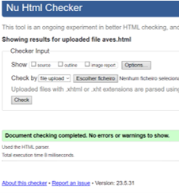
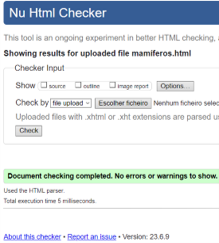
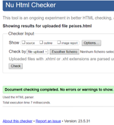
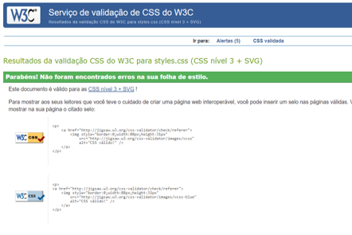

# Animais

## Apresentação do projeto

### Resumo do tema escolhido 

O nosso grupo escolheu o tema do jardim zoológico, relacionado com a temática dos animais, devido à combinação dos interesses individuais dos membros. O objetivo deste trabalho é fornecer aos utilizadores informações sobre várias espécies, o funcionamento e as regras do jardim zoológico. Ao realizar esta pesquisa, esperamos que as pessoas possam compreender mais facilmente o funcionamento da vida selvagem e a sua importância, despertando um maior interesse em aprender sobre o assunto. Através do nosso site, pretendemos apresentar o trabalho de criadores, biólogos e médicos especializados nesse campo. Vamos abordar tanto espécies mais conhecidas como aquelas menos conhecidas, com o objetivo de apresentar ao leitor novos animais para conhecer ou aprofundar o seu conhecimento sobre eles. Também vamos explorar um pouco da história da criação do próprio jardim zoológico.

Em resumo, o nosso objetivo é criar um website que transmita o máximo de conhecimento possível, com base na pesquisa realizada para a elaboração deste trabalho, e que seja facilmente compreensível para os leitores.

## Interface com o utilizador 

### Wireframe

## Produto

### Descrição do produto

Ao entrar no site do zoológico, você é recebido por uma interface gráfica envolvente e cativante, projetada para despertar o seu interesse pela vida selvagem. O layout geral é organizado e intuitivo, com uma combinação harmoniosa de cores naturais, como tons de verde e azul, para evocar uma sensação de conexão com a natureza.

No topo da página inicial, você encontra o logotipo do zoológico. Por baixo do logotipo, há um menu de navegação claro e fácil de usar, com abas como "Início", "Aves", "Mamíferos", "Peixes".

Logo abaixo do menu, há uma imagem em destaque que mostra uma cena cativante do zoológico, como um animal emblemático em seu habitat natural.
Conforme você rola a página inicial, encontra seções informativas sobre os diferentes animais que o zoológico abriga. Cada seção é representada por uma imagem grande e atraente de um animal em destaque, acompanhada de um título e uma breve descrição. 

No geral, a interface gráfica do site do zoológico é atraente, informativa e fácil de usar, proporcionando aos visitantes uma experiência virtual envolvente que desperta o interesse pela vida selvagem e encoraja a visita pessoal ao zoológico.

### Ligação para o site do grupo da netlify

[Netlify](https://inf22tig04.netlify.app/)

### Regras de utilização 

Para utilizar o nosso site não é preciso nada, além da curiosidade para aprender factos novos sobre a nossa fauna e cada vez mais ter vontade de aprender mais sobre este mundo incrível que é o da vida selvagem.

### Ajuda à navegação

O site está disposto de maneira a ser o mais intuitivo e simples possível, para que qualquer pessoa consiga entender o máximo que conseguir e consequentemente aprenda mais. 

### Validação do HTML e CSS

Para validação tanto doS documentos HTML quanto do documento CSS fizemos através do site da W3C [Validador de HTML](https://validator.w3.org) e [Validador de CSS](https://jigsaw.w3.org/css-validator/).

